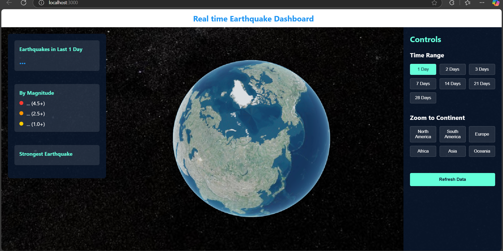
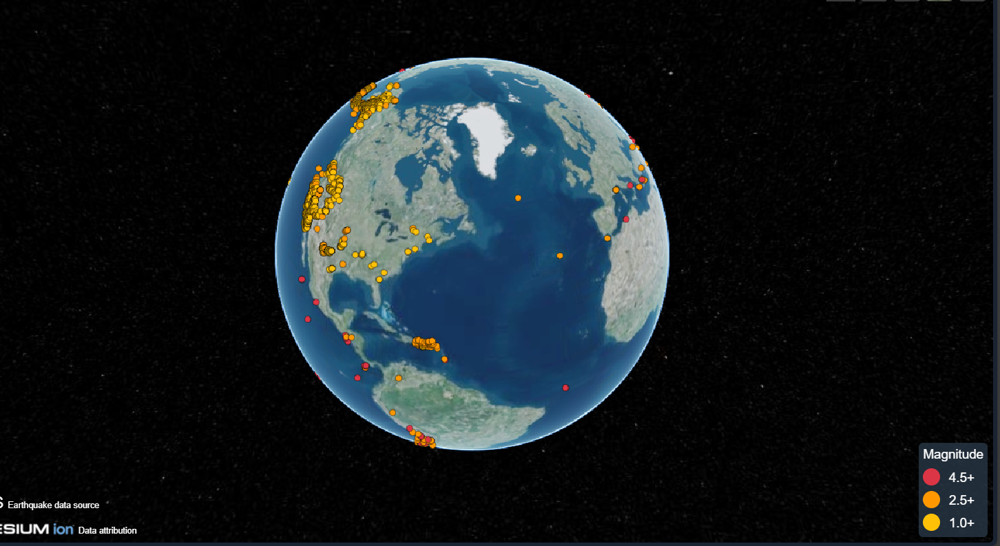

# Earthquake Dashboard React App

A React application to visualize real-time earthquakes using Cesium and US Geological Survey API.

## Features

- Real-time earthquake data visualization
- Interactive map with Cesium
- Filter earthquakes by magnitude and date range
- Zoom to different continents
- Responsive design


### Earthquake Map


### Filter Options


## Installation

To run this project, you will need to have [Node.js](https://nodejs.org/) and [npm](https://www.npmjs.com/) installed on your machine.

1. Clone the repository:

    ```bash
    git clone https://github.com/dhanavanthesh/earthquake-dashboard-react.git
    cd earthquake-dashboard-react
    ```

2. Install the dependencies:

    ```bash
    npm install
    ```

3. Start the development server:

    ```bash
    npm start
    ```

The application should now be running on [http://localhost:3000](http://localhost:3000).

## Usage

- Use the filter options to select the date range and magnitude of earthquakes to display.
- Click on the markers on the map to view more information about each earthquake.
- Use the continent zoom buttons to quickly focus on specific regions.

## Technologies Used

- React
- Cesium
- US Geological Survey API


- [Dhanavanthesh s](https://github.com/dhanavanthesh)
